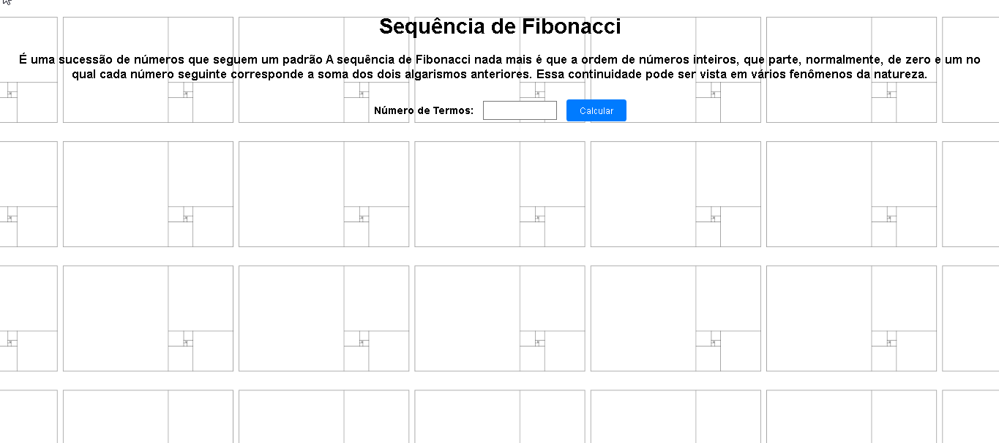

# Calculadora da Sequência de Fibonacci 
Este repositório contém um projeto simples em JavaScript para calcular a sequência de Fibonacci.

## Descrição

O projeto consiste em um código em JavaScript que calcula os primeiros termos da sequência de Fibonacci e os exibe no terminal.

## Capturas de Tela
*Página Inicial*

*Resultado da sequência de Fibonacci no número 7*

## Tecnologias Utilizadas

- **JavaScript:** Linguagem de programação utilizada para desenvolver a lógica do cálculo da sequência de Fibonacci.
- **CSS:**  Linguagem de estilo utilizada para estilização e layout da página.
- **HTML:** Linguagem de marcação utilizada para estruturar a página web. 

## Desenvolvimento

Este projeto foi desenvolvido como parte do meu aprendizado em JavsScript. A seguir, descrevemos a lógica por trás do código JavaScript utilizado para alcançar os objetivos definidos.

OBJETIVO 1 - Calcular os n primeiros termos da sequência de Fibonacci
        passo 1 - Definir uma função que recebe o número de termos desejados como entrada
        passo 2 - Inicializar a sequência de Fibonacci com os dois primeiros números (0 e 1)
        passo 3 - Usar um loop para calcular os termos subsequentes, somando os dois números anteriores
        passo 4 - Armazenar os termos em uma lista e retorná-la

OBJETIVO 2 - Exibir os termos calculados no terminal
        passo 1 - Receber o número de termos desejados como entrada do usuário
        passo 2 - Chamar a função de cálculo da sequência de Fibonacci com o número de termos como argumento
        passo 3 - Imprimir os termos calculados no terminal

